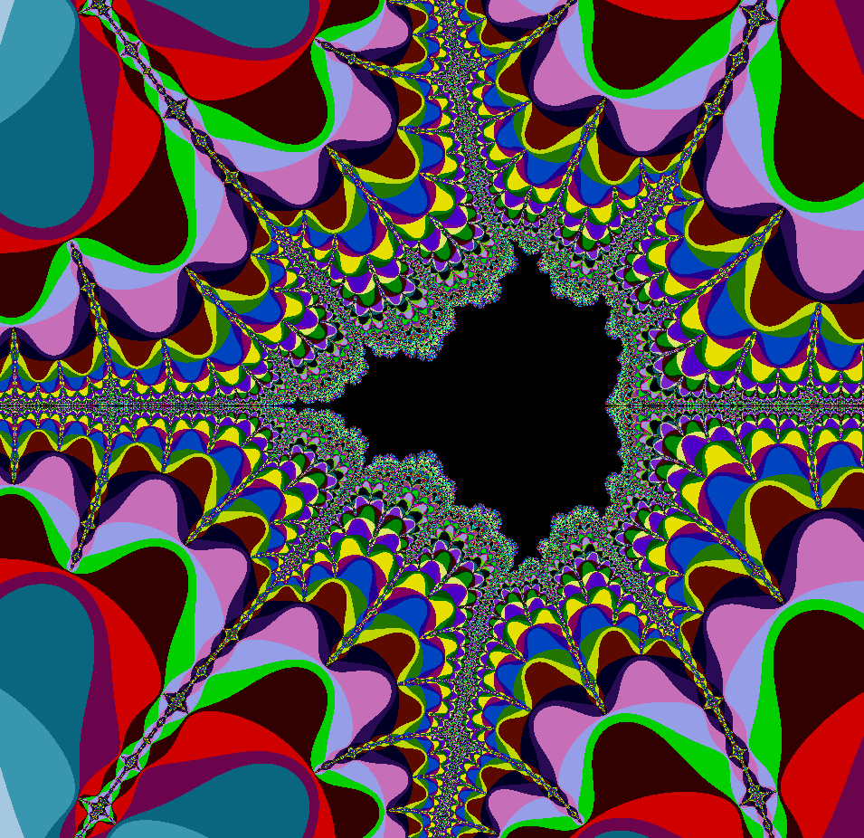
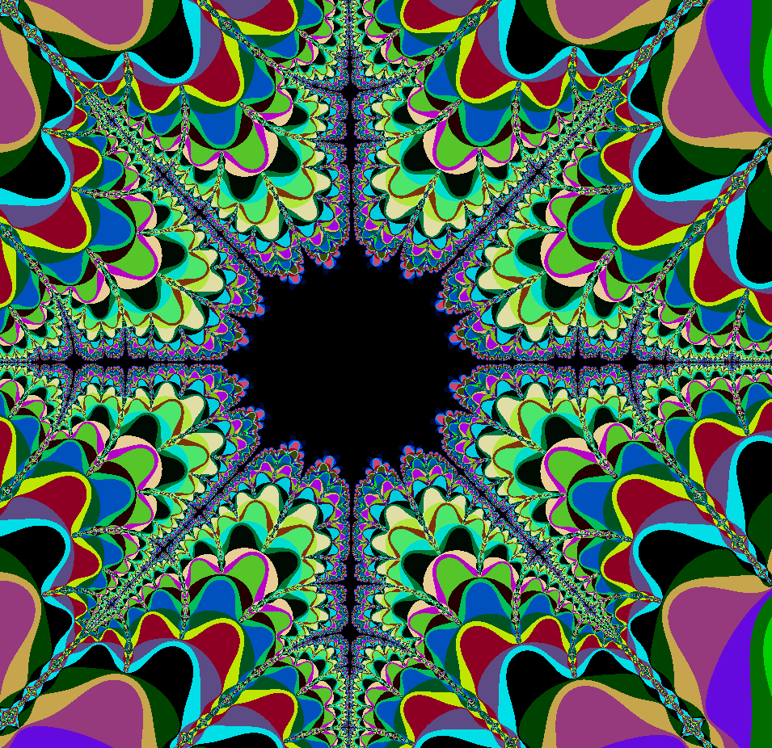

# fractaml

This is the [mandelbrot set](https://en.wikipedia.org/wiki/Mandelbrot_set) implemented in OCaml.





## External Dependencies

- [js_of_ocaml](https://opam.ocaml.org/packages/js_of_ocaml/)
- [js_of_ocaml-ppx](https://opam.ocaml.org/packages/js_of_ocaml-ppx/)
- [npm](https://nodejs.org/en/)

## How to run Fractaml

To execute the program, you first need `opam` to install the dependencies:

```bash
eval $(opam env)
opam install js_of_ocaml js_of_ocaml-ppx dune
```

To run:

```bash
dune build
npx serve

```

Go to `localhost:3000` to check out the fractal.
